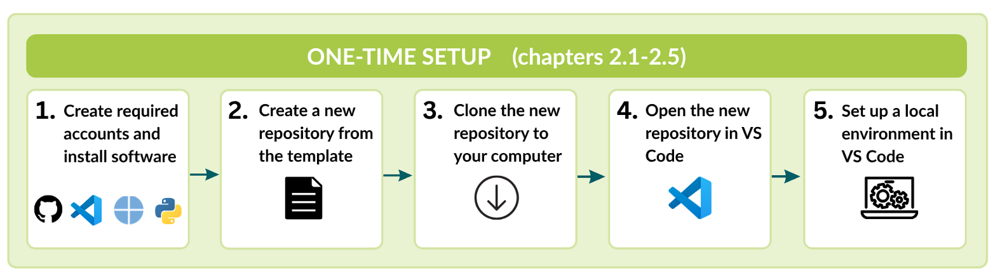
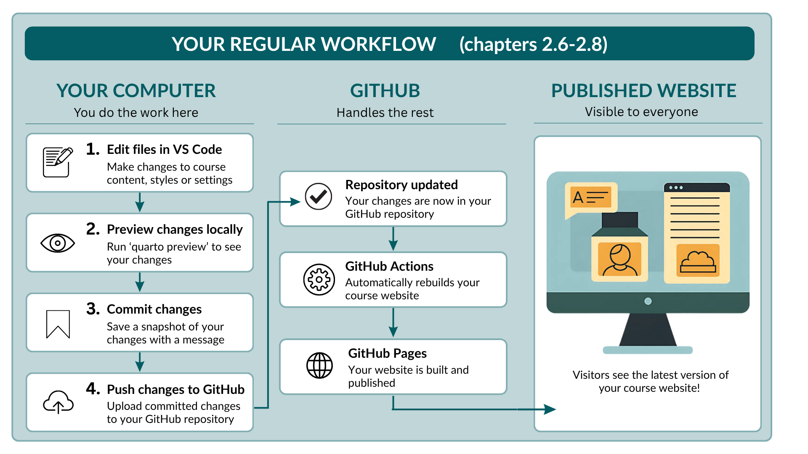

<br>

This chapter explains how to create your own copy of the SciLifeLab Course Page Template, set it up on your computer, and publish your first changes.

By the end of this chapter, you will have your own course repository, be able to edit and preview your course website locally, and know how to publish updates to GitHub.

You do not need prior experience with Git, GitHub, Visual Studio Code, or Quarto. Each section provides step-by-step instructions and explains what you should expect to see before moving on to the next step.

The chapter is divided into two parts:

- One-time setup: the steps you only need to complete once when creating a new course repository.
- Regular workflow: the steps you will repeat whenever you update your course website.

**One-time setup**

The following steps prepare your computer and create your course repository.

{width=85% fig-alt="Workflow showing the one-time setup steps for creating and configuring a new course repository."}

- [Create required accounts and install required software](#create-accounts-and-install-software)
- [Create a repository from the template](#create-a-repository-from-the-template)
- [Clone the repository to your computer](#clone-the-repository-to-your-computer)
- [Open the repository in Visual Studio Code](#open-the-repository-in-visual-studio-code)
- [Set up the local environment](#set-up-the-local-environment)

**Regular workflow**

Once the one-time setup is complete, the following workflow is all you need to edit and publish changes to your course website.

{width=87% fig-alt="Workflow showing the regular editing and publishing workflow for the course website."}

- [Preview the course website locally](#preview-the-course-website)
- [Commit and push your changes](#commit-and-push-your-changes)
- [View the published website](#view-the-published-website) 
  

At the end of each section, you will find a **Quick reference** box summarising the most important steps. These boxes provide a quick reminder of the tools, files, and actions involved, making it easy to return to the guide after you have completed the initial setup.

<br>

## Create accounts and install software

Before creating your course repository, make sure you have the accounts and software needed to work with the SciLifeLab Course Page Template.

| Software | Why you need it |
|---|---|
| Git | Download the repository to your computer and upload your changes to GitHub. |
| Quarto | Build and preview the course website. |
| Python 3 | Create the virtual environment and run the template scripts. |
| Visual Studio Code | Edit the course files and manage your repository. |
| GitHub account | Store your course repository and publish your course website. |


### Install Git

Git is used to download your course repository to your computer and upload your changes back to GitHub.

To install Git, follow the instructions provided in the official Git installation guide:

<https://github.com/git-guides/install-git> 

### Install Quarto
Quarto builds and previews the course website.

Download and install the latest version of Quarto from:

<https://quarto.org/docs/get-started/>


### Install Python

Python is used to create the virtual environment and run the template scripts.

Download and install the latest stable version of Python from:

<https://www.python.org/downloads/>


### Install Visual Studio Code

Visual Studio Code (VS Code) is the editor used throughout this guide to edit and preview the course website.

If you do not already have VS Code installed:

1. Visit <https://code.visualstudio.com/>.
2. Download the version for your operating system.
3. Follow the installation instructions.
4. Open VS Code once to check that it starts correctly.

<span style="color: red; font-weight: bold;">Screenshot: Visual Studio Code download page.</span>

::: {.callout-tip}
Throughout this guide, all file editing and Git operations are demonstrated using VS Code. You may use a different editor if you prefer, but the instructions and screenshots assume you are using VS Code.
:::


### Create a GitHub account
GitHub is used to store your course repository, collaborate with others, and publish your course website.

If you do not already have a GitHub account:

1. Visit <https://github.com>.
2. Click **Sign up**.
3. Follow the instructions to create an account.

If your course repository will be hosted within a GitHub organisation (for example [SciLifeLab-Training](https://github.com/SciLifeLab-Training), [SciLifeLabDataCentre](https://github.com/ScilifelabDataCentre), or [NBISweden](https://github.com/NBISweden)), ask an organisation administrator to add your GitHub account as a member before continuing.

<span style="color: red; font-weight: bold;">Screenshot: GitHub sign-up page.</span>


::: {.quick-reference}

<span class="quick-reference-title">Quick reference</span>   
<span class="quick-reference-subtitle"> Create accounts and install the required software </span>

| To... | Visit |
|---|---|
| Install Git | <https://github.com/git-guides/install-git> |
| Install Quarto | <https://quarto.org/docs/get-started/> |
| Install Python | <https://www.python.org/downloads/> |
| Create a GitHub account | <https://github.com> |
| Download Visual Studio Code | <https://code.visualstudio.com/> |

:::

## Create a repository from the template

The first step is to create your own copy of the SciLifeLab Course Webpage Template. This creates a new repository for your course, while leaving the original template unchanged.

### Open the template repository

In your web browser, open the [SciLifeLab Course Webpage Template](https://github.com/SciLifeLab-Training/scilifelab-training-template-staging/tree/main).

In the top-right corner of the page, click the green **Use this template** button and select **Create a new repository**.

<span style="color: red; font-weight: bold;">image:  fig-alt="GitHub repository page showing the Use this template button."</span>


### Configure your new repository

GitHub will open the **Create a new repository** page.

1. At the top of the page, make sure **Include all branches** is turned **on**.

2. Under **Owner**, select the GitHub organisation or account where the course repository should be hosted (e.g. SciLifeLabDataCentre, SciLifeLab-Training, NBISweden, Stockholm University, or your personal GitHub account).

::: {.callout-note}
If the organisation you need does not appear under **Owner**, contact an administrator or owner of that organisation to request access.
:::

3. Under **Repository name**, enter a name for your course repository. Use lowercase letters where possible and separate words with hyphens (`-`), for example `introduction-to-r`.

::: {.callout-tip}
Choose the repository name carefully. The repository name becomes part of the URL of your published course website.
:::

4. Optionally, add a short description of your course.

5. Choose the repository **visibility**. For most courses, select **Public** so that the course website and training materials can be accessed by others. Select **Private** only if access to the repository and course materials should be restricted.

6. Click **Create repository**.

<span style="color: red; font-weight: bold;">image: fig-alt="GitHub form for creating a repository from a template, including the owner, repository name, visibility and Include all branches options.</span>

### Check your new repository

GitHub will create the repository and automatically open its main page.

Check the repository name at the top of the page to make sure you are now working in **your new course repository**, rather than the original SciLifeLab Course Page Template repository.

<span style="color: red; font-weight: bold;"> image: fig-alt="GitHub page showing a newly created repository based on the course page template."</span>

### Add the website link to your repository

Once your course website has been published, you can add its URL to your GitHub repository. This makes it easy to open the published website directly from the repository home page.

1. In your GitHub repository, click the **Code** tab.

2. On the right-hand side of the page, locate the **About** section and click the **Settings** <span aria-hidden="true">⚙️</span> icon.

<span style="color: red; font-weight: bold;">Screenshot: Repository home page showing the About settings button.</span>

3. In the **Edit repository details** dialog:

   - Select **Use your GitHub Pages website to automatically fill the Website URL**.
   - Click **Save changes**.

<span style="color: red; font-weight: bold;">Screenshot: Edit repository details dialog with the GitHub Pages option selected.</span>

The URL of your published course website will now appear in the **About** section of your repository. You can use this link to quickly open the latest version of your course website at any time.

### Add collaborators

If other people will help develop or maintain the course, you can give them access to the repository. If you do not yet know who will contribute, you can return to this step later.

1. In your course repository, click **Settings**.

2. Under **Access** in the menu on the left, click **Collaborators and teams**.

<span style="color: red; font-weight: bold;">fig-alt="GitHub repository settings with Collaborators and teams selected under Access."</span>

3. Click **Add people** or **Add teams**, depending on who you want to give access to.

- Search for the GitHub user or team.
- Select the appropriate repository role.
- Click **Add** to confirm.

::: {.callout-note}
The options available under **Collaborators and teams** depend on whether the repository belongs to a personal GitHub account or a GitHub organisation, and on your permissions within that organisation.
:::

Your course repository is now ready to use. In the next section, you will create a local copy of the repository on your computer so that you can begin editing the course website.

::: {.quick-reference}

<span class="quick-reference-title">Quick reference</span>   
<span class="quick-reference-subtitle"> Create a repository from the template </span>

| To... | Location | Action |
|---|---|---|
| Create a new course repository | SciLifeLab Course Page Template | Click **Use this template** → **Create a new repository**. |
| Copy all template branches | Repository creation page | Turn **Include all branches** **on**. |
| Choose where to create the repository | **Owner** | Select your GitHub organisation or personal account. |
| Name the repository | **Repository name** | Use lowercase letters and hyphens (`-`) instead of spaces. |
| Choose the repository visibility | **Visibility** | Select **Public** for most course websites. |
| Add collaborators | **Settings** → **Collaborators and teams** | Add people or teams and assign the appropriate role. |
| Add the course website link | **Code** → **About** → **Settings** | Select **Use your GitHub Pages website to automatically fill the Website URL** and click **Save changes**. |

:::


## Clone the repository to your computer

You now have your course repository on GitHub. The next step is to create a copy of it on your computer so that you can edit, preview, and test the course website locally.

Creating a copy of a GitHub repository on your computer is called **cloning**.

Any changes you make remain on your computer until you **commit** and **push** them back to GitHub. This gives you the opportunity to preview your changes, experiment safely, and fix any mistakes before they become visible to collaborators or visitors to your course website.

### Copy the repository URL

On the main page of your course repository, click the green **Code** button.

Make sure **HTTPS** is selected, then copy the repository URL.

<span style="color: red; font-weight: bold;">Screenshot: GitHub Code menu showing the HTTPS repository URL.</span>

### Clone the repository

First, decide where you would like to keep your GitHub repositories on your computer. A common choice is to create a folder called `GitHub` inside your `Documents` folder.

You will then use a terminal to navigate to this location and clone the repository.

1. To navigate to your chosen folder, open a terminal and use the command `cd` 

For example, to use a `GitHub` folder inside `Documents` on macOS, copy and paste the following into the terminal:

```bash
cd ~/Documents/GitHub
```

<span style="color: red; font-weight: bold;">Screenshot: Terminal showing the command above.</span>

::: {.callout-tip}
You only need to choose this location once. When you clone the repository, Git will automatically create a new folder with the repository name inside this location.
:::


2. To then clone your new repository into this folder, copy and paste the following into your terminal: 

```bash
git clone REPOSITORY-URL
```

Replace `REPOSITORY-URL` with the HTTPS URL you copied from GitHub.

For example:

```bash
git clone https://github.com/ORGANISATION/my-course.git
```

<span style="color: red; font-weight: bold;">Screenshot: Terminal showing the completed `git clone` command.</span>

Git will download the repository and create a new folder containing all of the files needed for your course website.

You now have a local copy of your course repository. In the next section, you will open it in Visual Studio Code and prepare it for editing.

::: {.quick-reference}

<span class="quick-reference-title">Quick reference</span>   
<span class="quick-reference-subtitle"> Clone the repository to your computer </span>

| To... | Tool | Action |
|---|---|---|
| Copy the repository URL | GitHub | Click **Code**, select **HTTPS**, and copy the repository URL. |
| Choose where to store the repository | Terminal | Navigate to the folder where you want to keep your GitHub repositories. |
| Clone the repository | Terminal | Run `git clone REPOSITORY-URL`. |
| Verify the repository was cloned | File Explorer/Finder | Check that a new folder with your repository name has been created. |

:::


## Open the repository in Visual Studio Code

Throughout this guide, you will use **Visual Studio Code (VS Code)**  to edit your course website, preview your changes, and manage the repository.

To open your new repository in VS Code:   
  
1. Open **Visual Studio Code**.
2. From the menu bar, select:
**File → Open Folder...**
3. Navigate to the repository you just cloned, select the repository folder, and click **Open**.

<span style="color: red; font-weight: bold;">Screenshot: VS Code showing the Open Folder dialog with the cloned repository selected.</span>

4.The files and folders in your repository should now appear in the **Explorer** panel on the left-hand side of the window.

Throughout this guide, you will edit files by selecting them from the Explorer.

<span style="color: red; font-weight: bold;">Screenshot: VS Code showing the Explorer panel with the repository opened.</span>

5. When you open the repository for the first time, VS Code may display a notification recommending extensions for this workspace (if these extensions are not yet installed). If so, click **Install** to install the recommended extensions, these provide support for working with the template. 

<span style="color: red; font-weight: bold;">Screenshot: VS Code showing the "Install Recommended Extensions" notification.</span>

You are now ready to set up the local environment needed to edit and preview your course website.

::: {.quick-reference}

<span class="quick-reference-title">Quick reference</span>   
<span class="quick-reference-subtitle"> Open the repository in Visual Studio Code </span>

| To... | Tool | Action |
|---|---|---|
| Open the repository | Visual Studio Code | Select **File → Open Folder...** and choose your repository folder. |
| Install the recommended extensions | Visual Studio Code | Click **Install** if prompted. |
| Browse the repository files | Explorer panel | Use the Explorer to open and edit files throughout this guide. |

:::

## Set up the local environment

Before you can preview and edit your course website in VS Code, you need to prepare the local environment on your computer.
For this, you can simply copy and paste the commands below into the terminal exactly as shown.

### Open a terminal
To open a terminal in VS Code, select 
**Terminal → New Terminal**. 

A terminal should open at the bottom of the VS Code window. 

<span style="color: red; font-weight: bold;">Screenshot: VS Code showing Terminal → New Terminal.</span>


### Check that Git, Quarto, and Python are installed

Before continuing, check that Git, Quarto, and Python have been installed correctly.

Copy and paste the following three commands into the terminaL. 

```bash
git --version
quarto --version
python3 --version
```

If each command prints a version number, the software has been installed correctly and you are ready to continue.

For example:

```text
git version 2.50.1
Quarto 1.8.24
Python 3.13.5
```

::: {.callout-note}
If one of the commands reports **command not found**, the corresponding software is not installed or cannot be found by your computer.

Return to **[Create accounts and install the required software](#create-accounts-and-install-software)**, install the missing software, and then repeat the commands above before continuing.
:::

### Create a virtual environment
Copy and paste the following command into the terminal, then press **Enter**.

```bash
python3 -m venv .venv
```

### Activate the virtual environment
Next, copy and paste the following command into the terminal, and press **Enter**: 

```bash
source .venv/bin/activate
```

If the command was successful, you should see `(.venv)` at the beginning of the terminal prompt.

For example:

```text
(.venv) username@computer my-course %
```

<span style="color: red; font-weight: bold;">Screenshot: Terminal showing (.venv) at the beginning of the prompt.</span>

### Install the required software
Finally, copy and paste the following commands into the terminal, and press **Enter**: 

```bash
python -m pip install --upgrade pip
python -m pip install -r requirements-dev.txt
```
This may take a minute or two. Once the installation is complete, your local environment is ready and you can preview your course website.

::: {.callout-tip}
You only need to create the virtual environment and install the required software once for each course repository.

The next time you work on the repository, simply open a terminal in VS Code and reactivate the virtual environment by running:

```bash
source .venv/bin/activate
```

You should again see `(.venv)` at the beginning of the terminal prompt.
:::

::: {.quick-reference}

<span class="quick-reference-title">Quick reference</span>   
<span class="quick-reference-subtitle"> Set up the local environment </span>

| To... | Tool | Action |
|---|---|---|
| Open a terminal | Visual Studio Code | Select **Terminal → New Terminal**. |
| Create the virtual environment | Terminal | Run `python3 -m venv .venv`. |
| Activate the virtual environment | Terminal | Run `source .venv/bin/activate`. |
| Install the required software | Terminal | Run `python -m pip install --upgrade pip` followed by `python -m pip install -r requirements-dev.txt`. |
| Check that the environment is active | Terminal | Verify that `(.venv)` appears at the beginning of the terminal prompt. |

:::

## Preview the course website
You are now ready to preview your course website on your computer.

The SciLifeLab Course Page Template uses **[Quarto](https://quarto.org/docs/websites/)** to build the website. Before publishing any changes, you can preview the website locally in your web browser to check that everything looks as expected.

The preview is only visible on your own computer. This allows you to safely experiment, edit, and test your course website before your changes become visible to collaborators or visitors.

### Start the preview - terminal 

To start the preview, open a terminal in VS Code. In the terminal, run:

```bash
quarto preview
```

Quarto will build the website and, after a few seconds, display an address similar to:

```text
http://localhost:4268/
```

In most cases, this page will open automatically in your default web browser. If it does not, copy the address from the terminal and open it manually in your browser.

<span style="color: red; font-weight: bold;">fig-alt="Course landing page displayed locally in a web browser using Quarto preview."</span>

### Start the preview - preview button 

Alternatively, you can start the preview directly from VS Code by clicking the **Open Preview** button in the top-right corner of the editor.

<span style="color: red; font-weight: bold;">Screenshot: VS Code showing the Open Preview button.</span>

This opens the website inside VS Code. To view the website in your default web browser, click the **Open in Browser** button.

<span style="color: red; font-weight: bold;">Screenshot: VS Code preview with the Open in Browser button highlighted.</span>

### Preview your changes

The website you are viewing is a **local preview**. It is only available on your computer and is not visible to anyone else.

As you **edit** and **save** files in VS Code, Quarto automatically rebuilds the website and refreshes the preview in your browser. This allows you to see your changes automatically without restarting the preview.

### Stop the preview

While the preview is running, the terminal is being used by Quarto. If you need to run other commands without stopping the preview, open a **second terminal** in VS Code.

When you are finished, return to the terminal where `quarto preview` is running and press **Ctrl+C** to stop the preview.

::: {.callout-tip}
You can start the preview at any time by either:

- running 

```bash
quarto preview
```
  
- clicking the **Open Preview** button in VS Code.
  
Whenever you return to work on your course, remember to first activate the virtual environment by running:

```bash
source .venv/bin/activate
```
:::

::: {.quick-reference}
<span class="quick-reference-title">Quick reference</span>   
<span class="quick-reference-subtitle"> Preview the course website </span>

| To... | Tool | Action |
|---|---|---|
| Start the preview | Terminal | Run `quarto preview`. |
| Start the preview | Visual Studio Code | Click the **Open Preview** button. |
| View the website in your browser | Visual Studio Code | Click the **Open in Browser** button from the preview window. |
| Preview your changes | Visual Studio Code | Save the file. The preview refreshes automatically. |
| Run additional commands | Visual Studio Code | Open a second terminal. |
| Stop the preview | Terminal | Press **Ctrl+C**. |

:::

## Commit and push your changes

So far, any changes you make exist only on your own computer.

To make these changes available to collaborators and publish them on your course website, you need to **commit** and **push** them to GitHub.

In this section, you will make a small change to the landing page and publish it to your repository.

### Make a small change

1. Open `_sections/hero.qmd`.

2. Locate the course title:

```text
:::{.hero__copy}
:::{.hero__title}
Course title
:::
```

3. Replace **Course title** with something recognisable, for example:

```text
:::{.hero__copy}
:::{.hero__title}
This is my first course website
:::
```

4. Save the file by pressing **Command+S** (macOS) or **Ctrl+S** (Windows/Linux).

If `quarto preview` is running, the preview should refresh automatically and display the updated title.

<span style="color: red; font-weight: bold;">Screenshot: Updated course title in the preview.</span>

### Open Source Control

In Visual Studio Code, click the **Source Control** icon in the Activity Bar on the left-hand side.

You should now see the files that have changed since you cloned the repository. In this example, `_sections/hero.qmd` should be listed under **Changes**.

<span style="color: red; font-weight: bold;">Screenshot: Source Control showing the modified file.</span>

### Stage the changes

Click the **+** button next to the file under **Changes**. When you hover over the **+** button, the tooltip will say **Stage Changes**.

Staging tells Git which changes you want to include in your next commit. Only staged changes will be committed and later published to your course website.

If you have made changes that you do not want to keep, you can either leave them unstaged or discard them using the **Discard Changes** button.

<span style="color: red; font-weight: bold;">Screenshot: Stage Changes button.</span>


### Commit the changes

At the top of the **Source Control** panel, enter a short description of the changes you made in the **Message** box.

For example:

```text
Update course title
```

Then click the blue **Commit** button.

<span style="color: red; font-weight: bold;">Screenshot: Commit message box and Commit button.</span>

### Push the changes to GitHub

After committing, click the blue **Sync Changes** button.

Visual Studio Code will upload (or **push**) your committed changes to GitHub.

<span style="color: red; font-weight: bold;">Screenshot: Sync Changes button.</span>

Once the upload is complete:

- your collaborators can see the changes in the GitHub repository;
- GitHub automatically republishes your course website with the new changes.

## View the published website

After you push your changes to GitHub, the course website is updated automatically. You do not need to publish the website yourself.

It usually takes less than a minute for GitHub to rebuild and republish the landing page.

### Check that the deployment was successful

1. Open your course repository on GitHub.

2. Click the **Actions** tab.

You should see a workflow called **pages build and deployment**. While the website is being rebuilt, the workflow will show a yellow indicator.

Once the deployment has finished successfully, a **green checkmark** will appear next to the workflow.

<span style="color: red; font-weight: bold;">Screenshot: GitHub Actions page showing a successful deploy-landing workflow.</span>

### View the published website

Once the **deploy-landing** workflow has finished successfully, you can view the updated course website.

1. In your GitHub repository, click the **Code** tab.

2. In the **About** section on the right-hand side, click the website URL you added earlier.

<span style="color: red; font-weight: bold;">Screenshot: Repository home page showing the website URL in the About section.</span>

The published course website will open in your web browser.

Refresh the page if necessary. The change you made to the course title should now be visible.

::: {.callout-tip}
If you do not see your changes immediately, wait a minute and refresh the page. GitHub Pages can sometimes take a short time to update after the deployment has finished.
:::

## Next steps

Congratulations! You now have your own copy of the SciLifeLab Course Page Template running locally and published through GitHub Pages.
Continue with:

- [Landing page](landing-page.qmd) to customise the landing page.
- [Course instances](course-instances.qmd) to create, manage and customize course instances.
- [FAIRification](fairification.qmd) to prepare your training materials for publication and reuse.