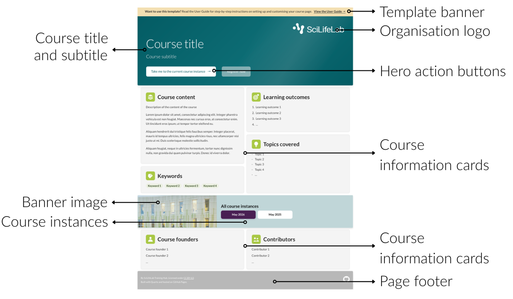

<br>

The [landing page](https://scilifelab-training.github.io/scilifelab-training-template-staging/) introduces your course and provides visitors with the information they need to decide whether they want to register for your course or   access a course instance.

The figure below shows the main sections of the landing page and the terminology used throughout this guide.

{width=75% fig-alt="Annotated example of the course landing page showing the template banner, course title and subtitle, organisation logo, hero action buttons, course information cards, course instance banner image, course instances, and page footer."}

  
In the following sections, you will find how to:

- [Remove the template banner](#remove-the-template-banner)
- [Change the course title and subtitle](#hero-change-the-course-title-and-subtitle)
- [Add or remove organisation logos](#hero-add-or-remove-a-logo)
- [Configure the hero action buttons](#hero-configure-the-current-course-instance-and-registration-action-buttons)
- [Edit the course information cards](#course-information-cards-edit-text)
- [Change the course instance banner image](#change-the-course-instance-banner-image)
- [Manage course instances](#manage-course-instances)
- [Edit the page footer](#edit-the-footer)

Each section in this chapter explains which file to edit and provides step-by-step instructions.  
    
At the end of each section, you will also find a **Quick reference** box summarising the most important changes. These boxes show you at a glance which file to edit and what to change, and can be useful when you return to the guide after you are already familiar with the individual steps.


<br>

## Remove the template banner 
The yellow banner at the top of the landing page provides a link to this User Guide. It is included to help you set up and customise the template and is **not intended to remain on your course website**.

Once you are ready to use the template for your own course, you can remove the banner.

1. In the main branch, open `index.qmd`.
2. Locate the following line:

```markdown

```

3. Delete this line.
The banner will no longer appear when the landing page is rendered.

::: {.callout-note}
You do not need to delete the file `_sections/template-banner.qmd`. Leaving the file in the repository will not affect your course website as long as it is no longer included in index.qmd.     
  
If you do want to delete the file:  

- **VS Code:** Right-click the file and select **Delete**.
- **GitHub Desktop:** Open the repository, locate the file, click the three dots (**⋮**), and choose **Delete file**.
 
:::

::: {.quick-reference}
<span class="quick-reference-title"> Quick reference </span>        
<span class="quick-reference-subtitle"> Remove the template banner </span>

| To... | File | Edit |
|-------|------|------|
| Remove the template banner | `index.qmd` | Delete the line that includes `_sections/template-banner.qmd`. |

:::


## Hero: Change the course title and subtitle
The **hero** is the large banner at the top of the landing page. It is the first thing visitors see when they open your course website and contains the course title, subtitle, logos, and 'current course instance' and 'registration' action buttons.

### Change the course title

1. In the main branch, open the `_sections` folder and then the file `hero.qmd`.
2. Locate the following lines:

```text
:::{.hero__title}
Course title
:::
```

3. Replace **Course title** with the title of your course.

### Change the course subtitle

1. In the main branch, open the `_sections` folder and then the file `hero.qmd`.
2. Locate the following lines:

```text
:::{.hero__subtitle}
Course subtitle
:::
```

3. Replace **Course subtitle** with a one-line description of your course.

::: {.callout-tip}
Keep the subtitle to one sentence and start with an action verb such as **Learn**, **Understand**, **Explore**, **Build**, or **Apply**.

For example:

> *Learn how to apply open science practices throughout the research lifecycle.*
:::


::: {.quick-reference}

<span class="quick-reference-title"> Quick reference   </span>   
<span class="quick-reference-subtitle"> Change course title and subtitle  </span>


| To... | File | Edit |
|-------|------|------|
| Change the course title | `_sections/hero.qmd` | Replace the text between `:::{.hero__title}` and `:::`. |
| Change the course subtitle | `_sections/hero.qmd` | Replace the text between `:::{.hero__subtitle}` and `:::`. |

:::


## Hero: Add or remove a logo

The logos displayed in the hero banner represent the organisations associated with your course. You can add additional logos, remove existing ones, or replace them with your own.


### Add a logo

1. Save your logo as a **PNG** or **SVG** file.

::: {.callout-tip}
If possible, use a **white** version of your logo so that it contrasts well with the dark background of the hero banner.
:::

2. In the main branch, open the `img` folder, then the `logos` folder.
3. Copy your logo file into the folder.
    - **VS Code:** Drag and drop the file into the folder.
    - **GitHub Desktop:** Click **Add file**, then **Upload files**.
4. In the main branch, open the `_sections` folder and then the file `hero.qmd`.
5. Locate the following block:

```html
<div class="hero__brand-item">
  
</div>
```

6. Copy the entire block and paste it directly below the existing one.
7. Replace only the `src` and `alt` values with those for your own logo.

For example:

```html
<div class="hero__brand-item">
  
</div>
```

### Remove a logo

1. In the main branch, open the `_sections` folder and then the file `hero.qmd`.
2. Locate the logo block you want to remove.

For example:

```html
<div class="hero__brand-item">
  
</div>
```

3. Delete the entire `<div class="hero__brand-item">...</div>` block.


4. OPTIONAL: If you no longer need the logo image, you can also delete it from the `img/logos` folder.
    - **VS Code:** Right-click the file and select **Delete**.
    - **GitHub Desktop:** Open the repository, locate the file, click the three dots (**⋮**), and choose **Delete file**. 


::: {.quick-reference}

<span class="quick-reference-title"> Quick reference </span>  
<span class="quick-reference-subtitle"> Add or remove a logo </span>


| To... | File | Edit |
|-------|------|------|
| Add a logo | `img/logos` | Copy your logo image (`.png` or `.svg`) into the folder. |
| Display a logo on the landing page | `_sections/hero.qmd` | Copy an existing `<div class="hero__brand-item">...</div>` block and update the `src` and `alt` attributes. |
| Remove a logo from the landing page | `_sections/hero.qmd` | Delete the corresponding `<div class="hero__brand-item">...</div>` block. |
| Delete an unused logo file (optional) | `img/logos` | Delete the logo image if it is no longer needed. |

:::


## Hero: Configure the *current course instance* and *registration* action buttons

The hero can display two action buttons:

- **Take me to the current course instance** links visitors to the current published course instance.
- **Register now** links visitors to the course registration page.

You can change these buttons' links and text, or hide them when they are not needed.

### Add a link to the *current course instance* button

1. In the main branch, open the `data` folder and then the file `instances.yml`.
2. Locate the course instance with:

```yaml
status: current
```

3. Update `slug`, `label`, `instance_url`, and `sort_key` to match the current course instance.

::: {.callout-important}

The values of `slug` and `instance_url` must match!

:::

For example:

```yaml
instances:
  - slug: "0000"
    label: "May 2026"
    status: current
    visible: true
    show_in_hero: true
    instance_url: "./0000/"
    registration_url: "https://example.org/registration"
    sort_key: 200000
```

For a course instance taught in May 2026, this could become:

```yaml
instances:
  - slug: "2605"
    label: "May 2026"
    status: current
    visible: true
    show_in_hero: true
    instance_url: "./2605/"
    registration_url: "https://example.org/registration"
    sort_key: 202605
```

::: {.callout-tip}
In this template, each course instance is generated from a repository branch and is named using the **year and month** in which the instance is taught.

For example, a course taught in May 2026 uses `2605`. Its relative course instance URL is therefore `./2605/`.

:::

### Add a link to the *registration* button

If registration for your training is open, you can display the **Register now** button and link it directly to your registration page.

1. In the main branch, open the `data` folder and then the file `instances.yml`.
2. Locate the course instance with:

```yaml
status: current
```

3. Find `registration_url`:

```yaml
registration_url: "https://example.org/registration"
```

4. Replace the example URL with the URL of your course registration page.

For example:

```yaml
registration_url: "https://your-registration-page.example"
```

### Hide the *current course instance* button

If you don't have a current course instance (e.g. if the course is self-paced or dormant), you can hide the **current course instance** button. 

1. In `data/instances.yml`, locate the current course instance and change:

```yaml
show_in_hero: true
```

to:

```yaml
show_in_hero: false
```

The current course instance can remain in `instances.yml`; it will simply no longer be displayed as a button in the hero.


### Hide the *registration* button

If the registration for your training is closed, or if the training doesn't require registration, you can hide the registration button.

1. In `data/instances.yml`, change:

```yaml
registration_url: "https://example.org/registration"
```

to:

```yaml
registration_url: ""
```

An empty `registration_url` tells the template not to display the registration button.


### Change action button text

You can also change the text displayed inside either action button without changing where the button links.

1. In the main branch, open the `data` folder and then the file `ui.yml`.
2. Locate:

```yaml
hero_view_current_label: Take me to the current course instance
hero_registration_open_label: Register now
```

3. Replace the text after the colon with the text you want to display.

For example:

```yaml
hero_view_current_label: View the latest course
hero_registration_open_label: Register for the course
```

Do not change the names `hero_view_current_label` or `hero_registration_open_label`. Only change the text after the colon.


::: {.quick-reference}

<span class="quick-reference-title">Quick reference</span>    
<span class="quick-reference-subtitle"> Configure the hero action buttons </span>  

| To... | File | Edit |
|---|---|---|
| Change the current course link | `data/instances.yml` | Update `slug`, `label`, `instance_url`, and `sort_key` to match the current course instance. |
| Change the registration link | `data/instances.yml` | Replace the value of `registration_url` with the URL of your registration page. |
| Hide the current course button | `data/instances.yml` | Change `show_in_hero: true` to `show_in_hero: false`. |
| Hide the registration button | `data/instances.yml` | Set `registration_url: ""`. |
| Change the current course button text | `data/ui.yml` | Change the value of `hero_view_current_label`. |
| Change the registration button text | `data/ui.yml` | Change the value of `hero_registration_open_label`. |

:::


## Course information cards: edit text 

The information cards below the hero banner provide key information about your course, including the course content, learning outcomes, topics covered, keywords, course founders, and contributors.
Each card can be edited independently. 


### Change the course content card

1. In the main branch, open the `_sections` folder and then the file `top-cards.qmd`.
2. Find the **Course content** card.
3. Under:

```text
:::{.card-copy}
Description of the content of the course

Lorem ipsum dolor sit amet, consectetur adipiscing elit...
```

replace the example text with a description of your course.

::: {.callout-tip}
Keep the course description concise and focus on what the course covers. Around 10 sentences is usually enough.
:::

### Change the learning outcomes card

1. In the main branch, open the `_sections` folder and then the file `top-cards.qmd`.
2. Find the **Learning outcomes** card.
3. Under:

```text
:::{.card-copy}
1. Learning outcome 1
2. Learning outcome 2
3. Learning outcome 3
```

replace the example learning outcomes with the learning outcomes for your course.

::: {.callout-tip}
Learning outcomes should describe what participants will be able to do after completing the course.  
For guidance on writing learning outcomes, see the [SciLifeLab Training Hub resource on writing learning outcomes](https://figshare.scilifelab.se/articles/educational_resource/Training_Hub_Resources_for_Learning_Outcomes/28473218).
:::

### Change the keywords card

1. In the main branch, open the `_sections` folder and then the file `top-cards.qmd`.
2. Find the **Keywords** card.
3. Under:

```text
:::{.card-copy}
- Keyword 1
- Keyword 2
```

replace the example keywords with keywords that describe your course.

::: {.callout-tip}
Around four or five keywords is usually enough. Choose short terms that describe the main subject areas of the course.
:::

### Change the topics covered cards

1. In the main branch, open the `_sections` folder and then the file `top-cards.qmd`.
2. Find the **Topics covered** card.
3. Under:

```text
:::{.card-copy}
- Topic 1
- Topic 2
```

replace the example topics with the main topics covered by your course.

::: {.callout-tip}
Use short phrases rather than complete sentences. Aim to give visitors a quick overview of the main subjects covered by the course.
:::

### Change the course founders card

The **Course founders** card can be used to acknowledge the people who originally developed or established the course.

1. In the main branch, open the `_sections` folder and then the file `bottom-cards.qmd`.
2. Find the **Course founders** card.
3. Under:

```text
:::{.card-copy}
- Course founder 1
- Course founder 2
```

replace the example names with the names of the course founders.


### Change the course contributors

The **Contributors** card can be used to acknowledge people who have contributed to the development or maintenance of the course.

1. In the main branch, open the `_sections` folder and then the file `bottom-cards.qmd`.
2. Find the **Contributors** card.
3. Under:

```text
:::{.card-copy}
- Contributor 1
- Contributor 2
```

replace the example names with the names of the course contributors.


::: {.quick-reference}

<span class="quick-reference-title">Quick reference</span>   
<span class="quick-reference-subtitle"> Edit the course information cards </span>  


| To... | File | Edit |
|---|---|---|
| Change the course content | `_sections/top-cards.qmd` | Replace the text in the **Course content** card. |
| Change the learning outcomes | `_sections/top-cards.qmd` | Replace the numbered list in the **Learning outcomes** card. |
| Change the topics covered | `_sections/top-cards.qmd` | Replace the bullet list in the **Topics covered** card. |
| Change the keywords | `_sections/top-cards.qmd` | Replace the bullet list in the **Keywords** card. |
| Change the course founders | `_sections/bottom-cards.qmd` | Replace the names in the **Course founders** card. |
| Change the course contributors | `_sections/bottom-cards.qmd` | Replace the names in the **Contributors** card. |

:::

## Change the course instance banner image
The *All course instances* banner contains a decorative image alongside the links to the available course instances. You can replace this image with an image that represents your course.

### 1. Add your image
1. In the main branch, open the `img` folder and then the `images` folder.
2. Add the image you want to use, for example:

```text
my-course-banner.jpg
```

::: {.callout-tip}
A landscape-oriented image works best because the image is cropped automatically to fill the available area.
:::


### 2. Update the image path

1. In the main branch, open the `_sections` folder and then the file `instances-band.qmd`.
2. Locate: 

```html
  
```

3. Replace `img/images/navet-band.png` with the path to your image, for example:

```html

```

The image is decorative, so the `alt` attribute can remain empty.

::: {.callout-tip}
Check how the image appears at different browser widths. The banner automatically crops the image to fill the available space.

If the most important part of your image is being cropped, you can adjust its position in `styles.css`. Find:

```css
.instances-band__image {
  object-fit: cover;
  object-position: center;
}
```

Change `object-position` to move the visible part of the image. For example:

```css
object-position: center top;
```

or:

```css
object-position: 30% center;
```
::: 


::: {.quick-reference}

<span class="quick-reference-title">Quick reference</span>   
<span class="quick-reference-subtitle"> Change the course instance banner image </span>  


| To... | File | Edit |
|---|---|---|
| Add a new banner image | `img/images/` | Add your course image to this folder. |
| Change the banner image | `_sections/instances-band.qmd` | Replace `img/images/navet-band.png` with the path to your image. |
| (Optional) Adjust how the image is cropped | `styles.css` | Change `object-position` under `.instances-band__image`. |

:::


## Manage course instances

The **All course instances** banner provides links to the different published instances of your course. This allows visitors to access the current course instance, as well as previous course instances that you choose to make available.

Course instances are managed in `data/instances.yml`. The instance marked as `current` is also used for the *Take me to the current course instance* action button in the hero. Some of the settings described in this section therefore overlap with the instructions for [configuring the hero buttons](#add-a-link-to-the-current-course-instance-button).

::: {.callout-important}
- Each course instance **must** have a unique `slug`. Do not use the same `slug` for more than one instance!

- Only **one course instance** should be marked as:

```yaml
status: current
```
- The instance marked as current determines which course instance is treated as the current course throughout the landing page, including the link used by the [hero action button](#add-a-link-to-the-current-course-instance-button). 
See [Mark a course instance as current](#mark-an-instance-as-current) for instructions.

:::


### Add a new course instance

1. In the main branch, open the `data` folder and then the file `instances.yml`.
2. Copy a full existing course instance entry.
3. Paste the copied entry under `instances:`.
4. Update the `slug`, `label`, `instance_url` and `sort key` values to describe the new course instance.

For example, for a new course instance taught in November 2026:

```yaml
- slug: "2611"
  label: "November 2026"
  status: current
  visible: true
  show_in_hero: true
  instance_url: "./2611/"
  registration_url: "https://example.org/registration"
  sort_key: 202611
```

### Mark a course instance as current
1. In the main branch, open the `data` folder and then the file `instances.yml`.
2. Find the previous current instance.
3. Change:

```yaml
status: current
```

to:

```yaml
status: previous
```

3. Set the new current instance to:

```yaml
status: current
```

For example:

```yaml
instances:
  - slug: "2611"
    label: "November 2026"
    status: current
    visible: true
    show_in_hero: true
    instance_url: "./2611/"
    registration_url: "https://example.org/registration"
    sort_key: 202611

  - slug: "2605"
    label: "May 2026"
    status: previous
    visible: true
    show_in_hero: false
    instance_url: "./2605/"
    registration_url: ""
    sort_key: 202605
```

### Show or hide a previous instance in the *All course instances* banner
1. In the main branch, open the `data` folder and then the file `instances.yml`.
2. To display an instance in the banner:

```yaml
visible: true
```

3. To hide an instance in the banner:

```yaml
visible: false
```

Hiding an instance does not delete it from `instances.yml`. It simply prevents it from being displayed in the banner.

::: {.callout-important}
The instance marked as:

```yaml
status: current
```

must always remain:

```yaml
visible: true
```

Do not hide the current course instance by setting `visible: false`. If you do not want the current instance to appear as a button in the hero, use:

```yaml
show_in_hero: false
```

instead.

:::

### Change the course instance name displayed in the banner
1. In the main branch, open the `data` folder and then the file `instances.yml`.
2. Change the value for `label`
For example:

```yaml
label: "May 2026"
```

can be changed to:

```yaml
label: "November 2026"
```

Changing the label only changes the text visitors see. It does not change the course instance URL.

### Change the order of course instances

The `sort_key` determines the chronological order of the course instances.

1. In the main branch, open the `data` folder and then the file `instances.yml`.
2. Change the value for `sort_key`. Use the format

```text
YYYYMM
```

For example:

```yaml
sort_key: 202605
```

represents May 2026.

::: {.quick-reference}

<span class="quick-reference-title">Quick reference</span>  
<span class="quick-reference-subtitle"> Manage course instances </span>  


| To... | File | Edit |
|---|---|---|
| Add a course instance | `data/instances.yml` | Copy an existing instance and update its values. |
| Set the current instance | `data/instances.yml` | Set `status: current` for the new instance and `status: previous` for the old one. |
| Show or hide a previous instance in the banner | `data/instances.yml` | Set `visible: true` or `visible: false`. |
| Change the displayed name | `data/instances.yml` | Change the value of `label`. |
| Change the instance order | `data/instances.yml` | Set `sort_key` using the format `YYYYMM`. |

:::

## Edit the footer
The footer at the bottom of the landing page contains information about the course page development, its licence, and a link to the course repository on GitHub.

### Change the footer text

1. In the main branch, open the `_sections` folder and then the file `footer.qmd`.
2. Locate:

```markdown
By SciLifeLab Training Hub. Licensed under [CC BY 4.0](https://creativecommons.org/licenses/by/4.0/).

Built with Quarto and hosted on GitHub Pages.
```

3. Replace the text with the information you want to display in the footer.

::: {.callout-tip}
If you use a licence other than **CC BY 4.0**, update both the licence name and its link.

In `[CC BY 4.0](https://creativecommons.org/licenses/by/4.0/)`:

- replace the text between `[ ]` with the name of the licence;
- replace the URL between `( )` with the corresponding licence URL.
:::


### Change the GitHub repository link

The GitHub logo in the footer links visitors to the course repository.

1. In the main branch, open the `_sections` folder and then the file `footer.qmd`.
2. Locate:

```html
<a href="https://github.com/SciLifeLab-Training/scilifelab-training-template-staging/tree/main" class="landing-footer__image-link">
```

2. Replace only the URL inside `href="..."` with the URL of your course repository.

For example:

```html
<a href="https://github.com/your-organisation/your-course/tree/main" class="landing-footer__image-link">
```

::: {.quick-reference}

<span class="quick-reference-title">Quick reference</span>   
<span class="quick-reference-subtitle"> Edit the footer </span>  


| To... | File | Edit |
|---|---|---|
| Change the footer text | `_sections/footer.qmd` | Replace the text inside the `landing-footer__meta` section. |
| Change the GitHub repository link | `_sections/footer.qmd` | Replace the URL inside `href="..."` with the URL of your course repository. |

:::
